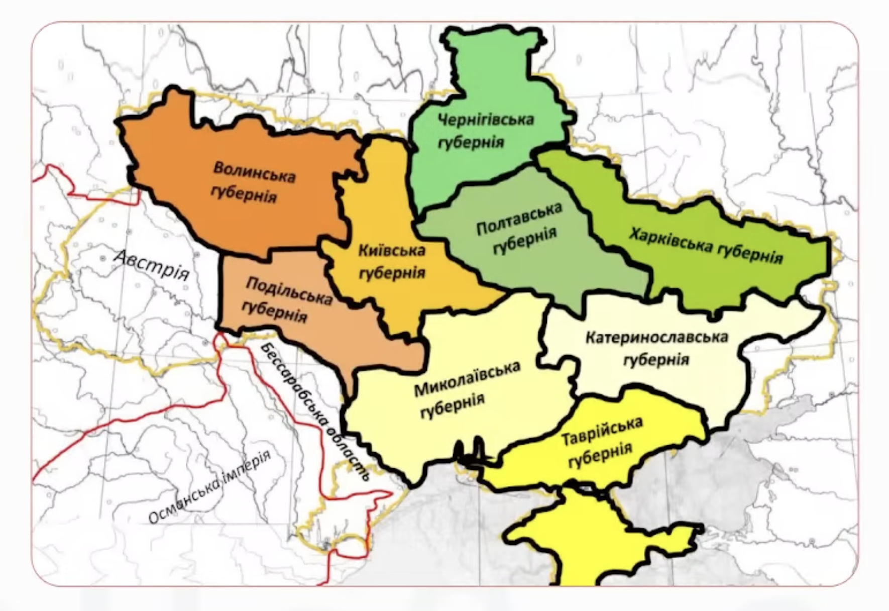

# АТУ укр. земель у складі Росії

Основні адмін.-тер. одиниці наступні:
* Генерал-губернаторства, у склад яких входили окремі Губернії

Укр. землі було поділено на 9 губерній по 3 генерал-губернаторства:
1. Малорос. ген.-губер.: **Чернігівська, Полтавська, Харківська**
2. Київське ген.-губер.: **Київська, Подільська, Волинська**
3. Новорос. ген.-губер.: **Катеринославська, Херсонська, Таврійська**

